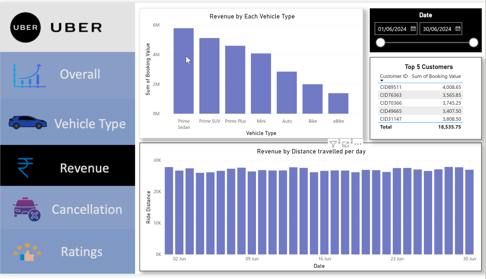
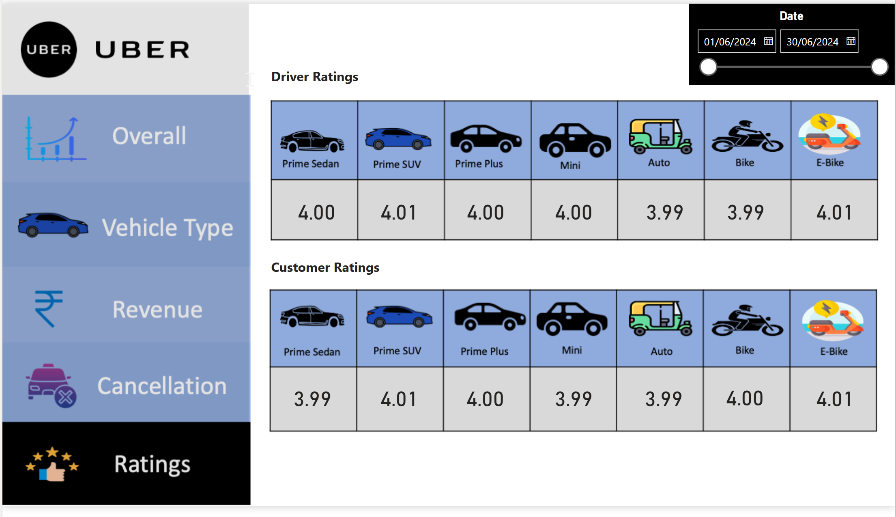

# Uber

## Overview 
Welcome to my analysis of uber ride bookings, focusing on data analyst role. This project was created for understanding the automobile tansportation market. 
In this project, we explore the end-to-end Process of a data through which a data passes, are as -
- ETL Process such as -
    - Collecting data
    - Data Cleaning (Excel, Power Query)
    - Data Loading (SQL, Power BI)
- Script or Query runner (Query tool, DAX)
- Extracting Insights 
- Data Visualisation (Power BI)
- Report Building (Word)

## The questions I have Answered - 

  
## Tools I used in this project -
- Excel
- Sql
- Power bi
- Power point
- MS word
- VS code
- Github Desktop

## Problem we have solved in this project - 
- Uber is facing higher ride cancellation to success ratio that we solved in this project through our analysis.
- I worked on others booking status with the technical team, as it is generated by system of technical problems.
- Ride Cancellation rate reduced to 10%.

### SQL Analysis -
You can find the SQL analysis in the following Query file.
- [uber_project_Query](uber_project_Query.sql)

  
### For the Report of this Analysis, You can refer to the link below -
-  "SQL_PROJECT_REPORT.docx" in the above file que and download by clicking on the view raw.

  
### Dashboard link
- https://app.powerbi.com/groups/me/reports/dd0b3cbc-63f7-47cc-b5a7-3be6796b9d43/cc623942b5aaf1e43d0f?experience=power-bi

### For downloading the Original raw file, you can refer to the file -
"vishal_project.pbix" in the above file que and download by clicking on the view raw.

 
#### Dashbord Images - 
These are only the images if you want to see the main file you can refer to the above dashboard link or download the raw file.
- 
- 
- 
- 
- 

  
## Conclusion 
In this project, I learnt to handle the task as a data analyst. Collecting data from sources or connecting with the databases for further analysis or to find the key-hidden insights from the data. By helping the uber company to solve their problem of ride cancellation, Cancellation reason most suffer from, other booking statuses and the revenue management system. And the team work that require for executing the analysis and for doing the analysis also.

#####  Thank you for visiting my Project!!
